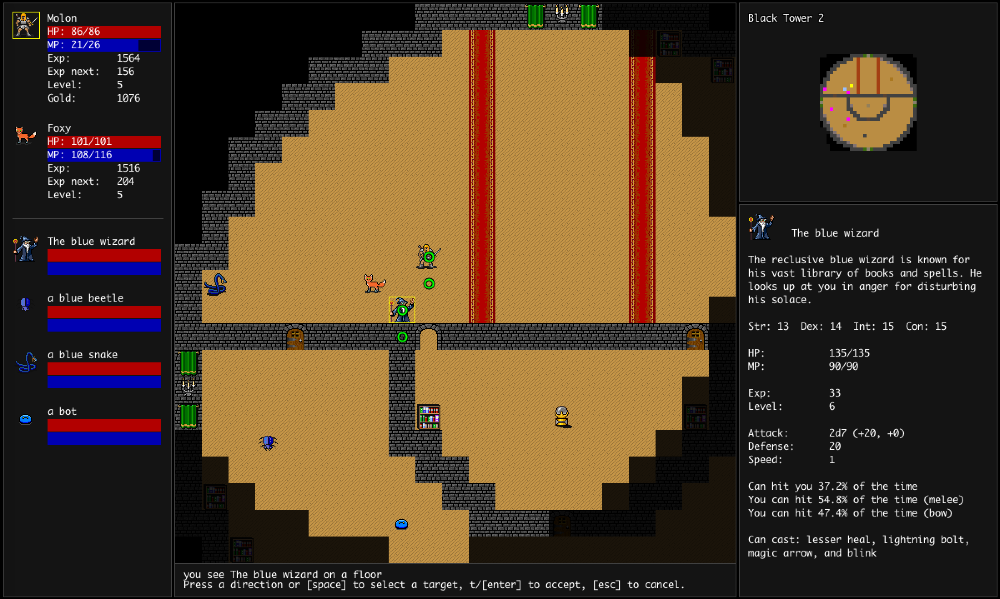
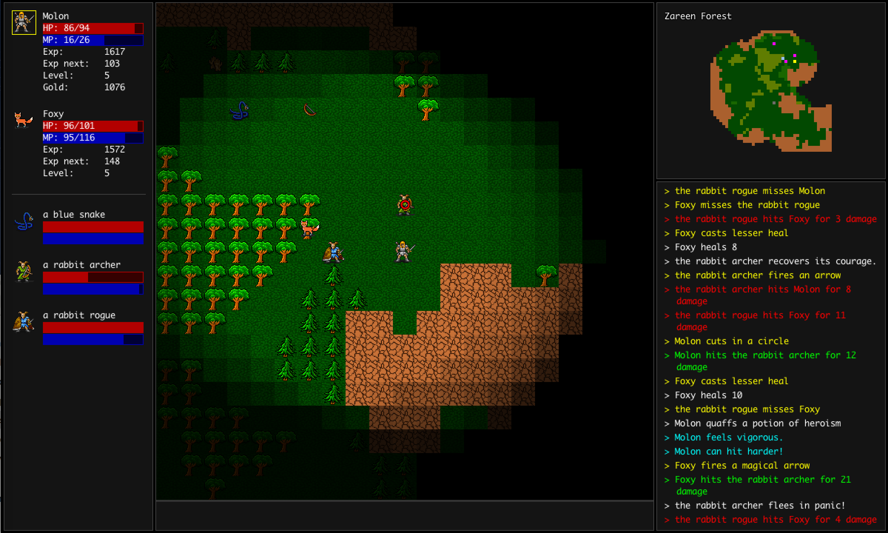

# Pearls of Wisdom

Pearls of Wisdom is a roguelike game -- it is single-player, keyboard
controlled, and non-real-time.  Each game you play, the dungeons will be
different, though they are persistent within a single game.

You play an adventurer, exploring levels, fighting monsters, and collecting
items.  The goal is to collect the eight pearls of wisdom, each one guarded by a
monster deep in a dungeon.

## Features

* Five different character classes to play.
* You can have a pet, and either control it yourself, or let the computer
  auto-play it.
* Smart pickup and optimization of equipment.
* Socketed items allow you to customize your weapons and armor.
* Ranged weapons and spells.
* Running.
* Stores (but they don't buy items, so you don't need to worry about keeping
  useless items for gold).
* Outside world and multiple dungeons and towns with different dungeon
  generation styles.
* No permadeath; games are saved when resting in an inn.
* Graphical interface, can be resized and use different fonts.
* Keyboard control only.  Keyset inspired by Angband, but simplified.
* In-game help.

## Screenshots

 
 

## FAQ

**Q:** How do I run it?

**A:** You will need Java 8 or later on your computer to run Pearls of Wisdom.  Once you
have it, just double-click the .jar file.

Additionally, you can run PoW through the command line, and specify a custom font.  
For example:

```
java pow-1.0.0-jar-with-dependencies.jar -Dfont.name="Helvetica" -Dfont.size=14
```

**Q:** Oops, something's wrong.  I think I found a bug.  Or, I have some feedback
to make the game better.

**A:** Open a ticket at https://github.com/jonathanacross/pow/issues

**Q:** Where are my games stored?

**A:** In `~/.pearls_of_wisdom/save`.  (~ is your home directory).

## Developer Information

PoW is written in Java. If you are building from source, you can compile it
using the command

```
mvn clean compile assembly:single
```

This will create a jar file in the target directory which you can double-click 
to start.
