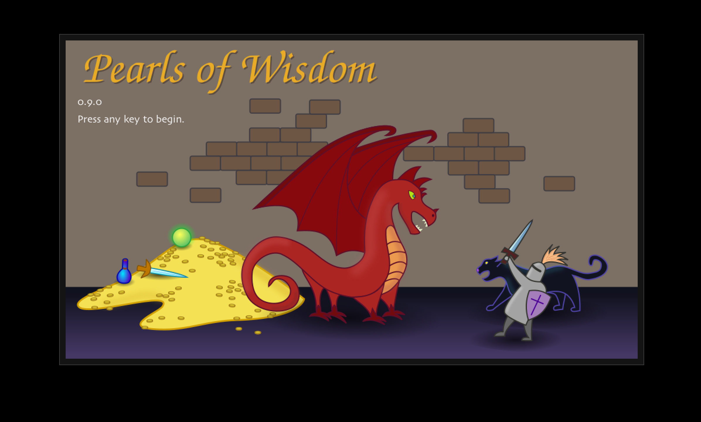

# Pearls of Wisdom

Pearls of Wisdom is a roguelike game -- it is single-player, keyboard
controlled, and non-real-time.  Each game you play, the dungeons will be
different, though they are persistent within a single game.

You play an adventurer, exploring levels, fighting monsters, and collecting
items.  The goal is to collect the eight pearls of wisdom, each one guarded by
a monster deep in a dungeon.

 

## FAQ

**Q:** How do I run it?

**A:** You will need Java 8 on your computer to run Pearls of Wisdom.  Once you
have it, just double-click the .jar file.

**Q:** Where are my games stored?

**A:** In `~/.pearls_of_wisdom/save`.  (~ is your home directory).

## Developer Information

PoW is written in Java. If you are building from source, you can compile it
using the command

```
mvn clean compile assembly:single
```

This will create a jar file in the target directory which you can double-click 
to start.
